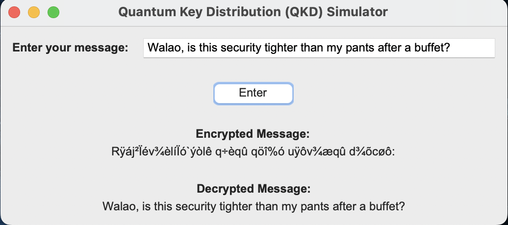

# Quantum Key Distribution (QKD) Simulator 🛡️🔐

This Python script simulates the process of secure key exchange using quantum cryptography. The simulator provides a graphical user interface (GUI) that allows users to type in their messages, encrypt them with QKD techniques, and observe the encrypted and decrypted outcomes. 

## Concepts Used
- **Quantum Key Distribution (QKD),** a secure communication method that uses the properties of quantum mechanics to establish a shared secret key between two parties.
- **Quantum Gates** which are operations performed on qubits to manipulate their states, such as the Hadamard gate (H), Pauli gates (X, Y, Z), and measurement gates.
- **Quantum Measurement** to extract information from qubits into classical bits. This measurement collapses the superposition and provides classical information based on the qubit's state.
- **Classical Communication** for the exchange of classical information between two parties to compare measurement bases and sift the key.
- **Error Correction** to detect and correct errors introduced during the transmission of qubits.
- **Privacy Amplification** to distill a shorter, secure key from a longer sifted key. The simulator applies a hash function to the sifted key, reducing its size while maintaining its cryptographic strength.
- **Hash Functions** which are cryptographic algorithms that transform data into fixed-length values. The simulator utilises a hash function (SHA-256) to amplify privacy and generate a secure key from the sifted key.

## Technologies Used
- **random** module for random number generation.
- **hashlib** module for the SHA-256 hash function.
- **qiskit** library for quantum circuit simulation.
- **tkinter** library for GUI development.

## How Does It Work?
1) **Initialisation.** The necessary components, including a quantum circuit and a graphical user interface (GUI) using tkinter, are set up in the __init__ method of the QKDSimulator class.
2) **Key Generation.** The user enters a message through the GUI. The generate_random_key method generates a random key of 0s and 1s. The prepare_qubits method prepares the qubits in the quantum circuit using quantum gates and the key values.
3) **Qubit Exchange.** The exchange_qubits_with_noise method simulates the exchange of qubits between two parties (Alicia and David) and introduces random errors (noise) to the qubits.
4) **Key Sifting.** The compare_bases method compares the bases used by Alicia and David, identifying matching bases. The sift_key method sifts the key based on the indices of the matching bases.
5) **Eavesdropping Detection.** The detect_eavesdropping method checks for potential eavesdropping by comparing the length of the sifted key with the number of matching bases. If they differ, potential eavesdropping is detected.
6) **Error Correction and Privacy Amplification.** The error_correction method performs error correction on the sifted key, and the privacy_amplification method applies a hash function to reduce information leakage in the final key.
7) **Classical Communication.** The classical_communication method converts the user's message into binary form (ASCII) and a list of bits.
8) **Message Encryption.** The encrypt_message_bits method encrypts the message bits using a bitwise exclusive OR (XOR) operation with the sifted key.
9) **Message Decryption.** The decrypt_message method decrypts the ciphertext by performing an XOR operation between the ciphertext and the sifted key.
10) **Output Display.** The encrypted and decrypted messages, in ASCII format, are displayed in the GUI.

## Potential Enhancements for the Future
- **Incorporating this** into practical applications like messaging.
- **Implementating advanced cryptography algorithms** to address future security challenges.
- **Implementating visualisation and analysis methods** to analyse the quantum operations, measurement outcomes, and security properties of the simulated QKD process.

## Contributing
Contributions are welcome! Feel free to reach out with your suggestions, bug reports, or feature requests.

## License
This project is licensed under the [MIT License](LICENSE).
